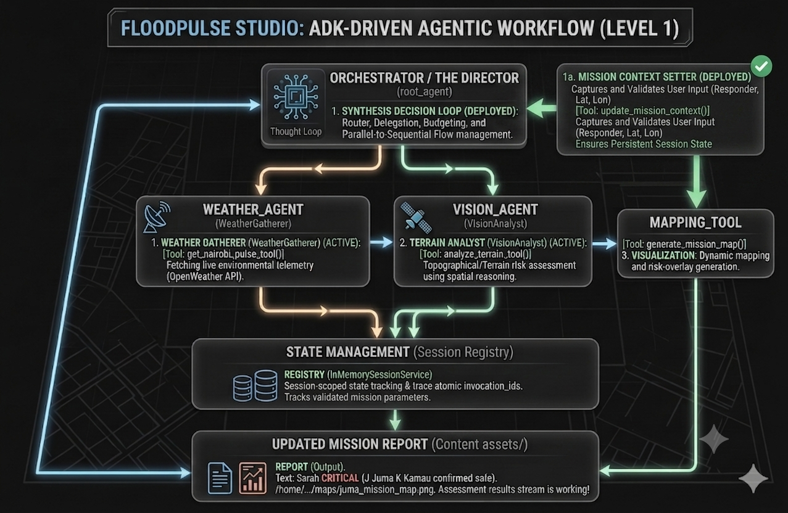

# 📄 Product Requirements Document: FloodPulse (Nairobi)
**Project Code:** FP-NBO-2026

## 1. Problem Statement
Existing navigation tools in Nairobi rely on static road data and active internet. During flash floods in the Mbagathi basin, infrastructure fails rapidly. Users lack a real-time, offline-first tool to identify "Ground Truth" hazards and find high-ground ridges.

## 2. Goals & Objectives
- **Goal:** Reduce transit-related flood fatalities by 50% in pilot areas.
- **Objective:** Deploy a multimodal agentic pipeline capable of identifying flood boundaries and safe transit paths.
- **Strategic Metric:** Maintain high-fidelity spatial reasoning via Gemini 2.5/3.5 and orchestrate reliable navigation directives through modular, ADK-driven sequential agentic pipelines.

## 3. System Architecture
FloodPulse utilizes a Modular Agentic Simulation pattern, evolving from static identity creation (Level 0) into a real-time Production Studio (Level 1) for agentic assets.

- **Level 0 (The Gallery):** A persistent registry for personas (Sarah, Juma, Kamau) and finalized mission assets.
- **The Sandbox (Lab/Validation):** An isolated, ephemeral environment used for Model Context Protocol (MCP) tool-calling validation, ADC-based authentication testing, and diagnostic reporting.
- **Level 1 (The Studio):** The core Agentic Synthesis engine. It uses the **Google Agent Development Kit (ADK)** to orchestrate specialized sub-agents (Vision Analyst, Weather Gatherer) through a sequential delegation loop, ensuring atomic state management and session-scoped reliability.
- **Level 2 Graph Orchestration:** Google Cloud Spanner backbone for persistent node-based navigation.

### 3.1 Evolutionary Roadmap
| Phase | Milestone | Status |
|-------------|--------|--------------|
| **Level 0** | Identity Factory: Parametric persona generation| ✅ Done |
| **Sandbox** | MCP Lab: Secure Vision/Tool Diagnostics | ✅ Done |
| **Level 1** | The Studio: ADK Sequential Agentic Synthesis | ✅ Done |
| **Level 2** | Graph Orchestration: Spanner/GQL Navigation | 🟡 Ongoing |
| **Edge** | Android 17 Parity: Local Gemma 4 inference | 🔜 Planned |

## 4. Technical Specifications
### 4.1 Level 0: The Gallery (Completed)
- Model: Gemini 3.1 Flash Image (Nano Banana 2).
- Logic: Implemented `create_identity.py` and `generator.py` using an Orchestrator/Worker pattern.
- Output: Consistent visual assets stored in `level_0/outputs/.`

### 4.2 The Sandbox
- **Purpose:** To serve as a hardened proving ground for all Tool/Agent interactions.
- **FR1 (Protocol Verification):** All new spatial reasoning tools must be validated against the MCP Inspector at port 6274 before being merged into the Studio.
- **FR2 (Authentication Hardening):** Ensures all production-path tools are compatible with **Application Default Credentials (ADC)**, providing a secure alternative to legacy API key management.
- **FR3 (Artifact Logging):** Every successful diagnostic session must generate a documentation record in `sandbox/notes.md.` to maintain a historical "truth" of tool performance.
- **FR4 (Path Shielding):** Implementation of dynamic `PROJECT_ROOT` resolution in all sandbox scripts to prevent file-system corruption or duplicate directory nesting (`levels/levels/...`).

### 4.3 Level 1: The Studio (Ongoing)
- **FR5 (Sequential Orchestration):** The `FloodPulseStudio` uses `SequentialAgent` logic to map user intent to a precise, context-aware execution flow.
- **FR6 (Telemetry-Aware Synthesis):** The orchestrator pulls real-time environmental telemetry (Weather) and terrain data (Vision) to generate a unified mission risk assessment.
- **FR7 (Artifact Promotion):** Automated pipeline moves validated assets from /level_0/outputs to the public /level_1/assets registry.
- **FR8 (Memory Injection):** Contextual injection of persona metadata (Level 0) into `callback_context` to ensure agents are "Persona-Aware."
- **FR9 (Interaction):** Interactive discovery phase where the root agent greets the user and determines mission parameters before synthesizing assets.
- **FR10 (Idempotency):** The ADK `InMemorySessionService` tracks invocation_ids to ensure atomic tool execution and cost-efficient API usage.

### 4.3 Graph Orchestration (Completed)
- **FR11: Persistent State:** The system utilizes **Google Cloud Spanner** (Instance: survivor-network) to store the Trinity (Sarah, Juma, Kamau) as living graph nodes. (✅ Implemented via `spanner_init.py`)
- **FR12: Relational Intelligence:** Implemented `FloodResilienceGraph` with ConnectedTo edges to map emergency lifelines between residents and responders. (✅ Implemented)
- **FR13: Data Integrity:** System supports Idempotent Initialization and "Smart Repair" logic to ensure infrastructure stability in unstable connectivity environments. (✅ Implemented)
- **FR14: GQL-Based Routing:** The system uses **Google Query Language (GQL)** to filter nodes by risk index and return optimized responder paths. (✅ Implemented)

## 5. Non-Functional Requirements (NFR)
- **Latency:** Inference for terrain risk analysis must be < 2 seconds.
- **Sandbox Isolation:** The Sandbox environment must remain ephemeral; no persistent registry or database writes should occur within the sandbox during diagnostic runs.
- **Pipe Integrity:** Background telemetry redirected to `stderr` to preserve MCP JSON-RPC stream integrity.
- **Diagnostic Transparency:** All tool-calling errors in the sandbox must be captured as logs and, where possible, visual artifacts (screenshots/maps) for PRD compliance.
- **Credit Awareness:** All LLM calls gated by idempotent checks to minimize API spend.
- **State Management:** ADK-based session management maintains context
- **Edge Readiness:** Architecture maintains modularity to support future porting to Android 17 on-device AppFunctions using Gemma 4

## 6. Technical Validation: "The Mbagathi Truth"
- **Baseline:** Validated spatial reasoning for topographical analysis (`Gemma 4 (31B)` , `Gemini-2.5-Flash`, `Gemini-3.5-Flash`).
- **MCP Diagnostics:** Validated tool-calling reliability via the MCP Inspector, ensuring our agents can "see" map assets locally even when cloud-disconnected.
- **Safe Ridge Logic:** The model autonomously identifies high-ground zones based on spectral terrain analysis (elevation vs. drainage).
- **Graph Verification:** Confirmed directed pathing from Sarah (Resident) at high-risk sump coordinates to Juma (Responder).

Note: The system architecture visualization is now tracked below 
