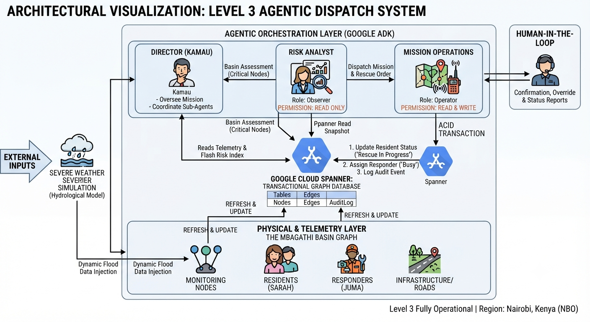

levels/level_3/README.md
# Level 3: Autonomous Emergency Operations (Agentic Orchestration & Dispatch)

## 📌 Overview
Level 3 transitions the **FloodPulse** project from static database queries and simulations to a fully autonomous, multi-agent disaster response network. This layer serves as the "Decision & Command Engine," leveraging Google Cloud Spanner transactional integrity alongside multi-agent orchestration via the Google Agent Development Kit (ADK) to protect the Mbagathi Basin in real-time.

### Architectural Visualization


## 🏗️ Architectural Components

### 1. Multi-Agent Separation of Concerns
To ensure system safety and reliability, Level 3 enforces a strict operational boundary between observation and execution:
* **Risk Analyst (`Risk_Analyst`)**: A read-only sub-agent responsible for querying basin telemetry, computing flash risk thresholds, and identifying critical nodes without holding any write or dispatch permissions.
* **Mission Operations (`Mission_Operations`)**: An authorized execution sub-agent that coordinates responder routing, calculates paths of least resistance using terrain weight graphs, and executes atomic database transactions.
* **Director (`floodpulse_director`)**: The high-level orchestrator (`Kamau`) that oversees the multi-agent loop, handles human-in-the-loop interactions, and coordinates mission execution based on basin assessments.

### 2. Atomic Database Transactions
All dispatches and rescue completions use Google Cloud Spanner's `run_in_transaction()` guarantees. This ensures that:
* A resident node state transitions safely to `'Rescue In Progress'`.
* An assigned responder status shifts to `'Busy'` (preventing double assignments).
* An immutable event record is written to the `AuditLog` table.

### 3. Graph-Based Rescue Routing
The `calculate_rescue_route` tool leverages the Spanner `Edges` table and dynamically updated `current_weight` parameters to route rescue units around flooded sectors based on the real-time flash flood simulation.

### 4. Session & Metadata Injection
The ADK runner initializes session metadata (`resident_id`, `responder_id`, `authority_name`) to personalize and contextualize agent interactions and track active missions seamlessly.

---

## 🚀 Quick Start

### Prerequisites
* Google Cloud Spanner instance with initialized tables (`Nodes`, `Edges`, `AuditLog`) from Level 2.
### Environment
* Ensure your root `.env` file contains the required configuration:
```
PROJECT_ID=floodpulse-nairobi
SPANNER_INSTANCE_ID=floodpulse-nairobi-lab
SPANNER_DATABASE_ID=floodpulse-db
```

### Deployment & Execution
1. **Run the Autonomous Mission Loop**:
   ```powershell
   PYTHONPATH=. uv run python levels/level_3/main.py

2. **Launch the ADK Developer Web UI:**
   ```powershell
   PYTHONPATH=. adk web levels/level_3 --allow_origins "regex:https://.*\.cloudshell\.dev"

### 🔍 Verification & Local Tool Testing
To test individual tool functions (such as proximity lookups and dispatch logic) locally before running the full agent loop:

   ```powershell
   PYTHONPATH=. uv run python levels/level_3/tools/mission_ops_tools.py
   ```

### 🛠️ Technical Decisions & Pivots
- **Strict Authorization Boundary:** Prohibited the `Risk_Analyst` from accessing write or update tools, ensuring that risk evaluation can never accidentally trigger a physical dispatch without operational approval.
- **Stateless Agent Resilience:** Required `Mission_Operations` to query immutable audit trails and live Spanner snapshots rather than relying on ephemeral agent memory, preventing race conditions during multi-unit responses.
- **Tool Wrapper Abstraction:** Decoupled raw SQL transaction scripts from high-level LLM prompts by wrapping core database functions into clean, typed Python tools consumable by the ADK framework.
---
Status: Level 3 Fully Operational | Region: Nairobi, Kenya (NBO)
