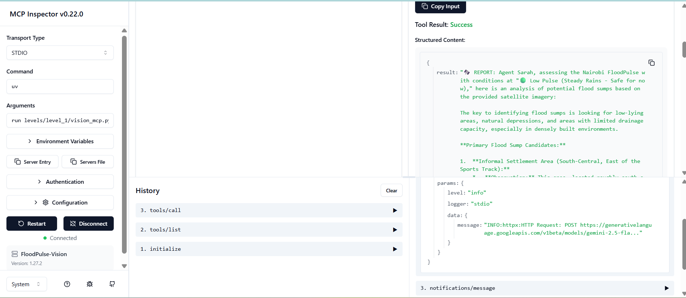

# FloodPulse Sandbox
This directory serves as the **experimental workspace** for the FloodPulse project. It contains live MCP (Model Context Protocol) test rigs and diagnostic tools used to validate agentic reasoning and tool integration.

## 🧪 Purpose
- **Tool Validation:** Testing the integration between the MCP Inspector, Gemini models, and the project's internal tools (e.g., `tools/weather_tools.py`).
- **Experimental Rigging:** Iterating on connection logic (ADC vs. API-based authentication) without impacting the production engine in `levels/.`
- **Lab Logging:** Documenting lessons learned, architecture discoveries, and troubleshooting notes.

## 📂 Contents
- `vision_mcp.py:` A unified MCP server that detects authentication mode via `.env` (`USE_VERTEX_AI=true/false`). Supports both rapid prototyping (API Key) and production-aligned (ADC) testing.
- `notes.md:` A comprehensive lab log detailing experiment results, authentication struggles, port configurations (6274), and model availability findings.

## 🚀 Getting Started
To interact with these tools, use the MCP Inspector:
1. **Ensure your environment is set:**
   Set `USE_VERTEX_AI=true` in your `.env` to use ADC, or `false` to use your API key.

2. Install the Inspector:
```
Bash
npm install -g @modelcontextprotocol/inspector
```
3. **Launch the test rig:**
 ```bash
 # Use PYTHONPATH to ensure the project modules are resolvable
 PYTHONPATH=. npx @modelcontextprotocol/inspector uv run sandbox/vision_mcp.py
```
4. Verify: Open the local dashboard at `http://localhost:6274` to execute tools and review responses.

### Visualizing the inspector results:


## 🛠️ Operational Notes
- **Authentication Logic:** The server automatically switches between Vertex AI (ADC) and API Key based on your `.env` configuration. Ensure `gcloud auth application-default login` is run locally if using ADC mode.
- **Path Resolution:** These scripts use dynamic pathing to locate the `PROJECT_ROOT.` Ensure you are executing from the project root to maintain correct module resolution.
- **Environment:** All successful tests recorded in [`notes.md`](notes.md) were performed in a local VS Code environment. Remote cloud development environments (like Cloud Shell) may face tunneling restrictions with the Inspector.